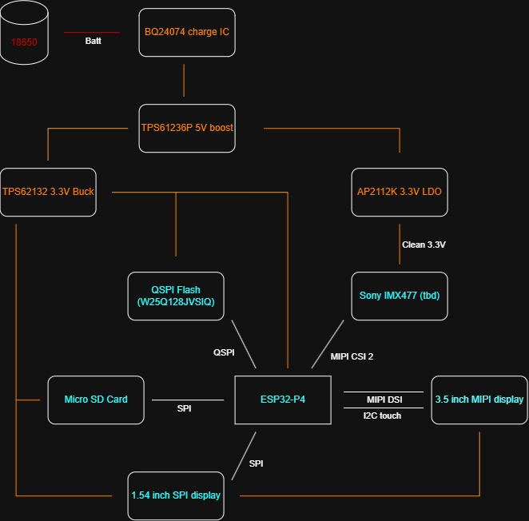

# 8th of September: Project planning, component choices and scope

I spent some time laying out the desired features of the camera and how I will achieve that through design planning and
component choice. The features I currently want are:

- Main 3.5" LCD display with touch capability (MIPI DSI interface + I2C)
- Secondary 1.54" SPI display for settings on the top of the camera
- ESP32-P4 for 2 lane MIPI CSI interface for common camera modules
- Interchangeable lenses (C mount?)
- 18650 battery and charge circuit in grip for long run time
- SD card slot
- USB C for charging, programming and file transfer
- Some sort of film emulation or Arri-style colour science emulation (ISP on ESP32)
- Decent resolution (5MP or more)
- Good UI (can't guarantee)
- Nice design (Inspiration from Hasselblad X2D or Fuji X1H)

I layed out a flow chart to show the main components and how they work together and have also started laying out a PCB
design in KiCAD following Espressif's reference design for the P4. The current TBD item is the sensor. While I would like
a fancy IMX sensor, due to limited software support on the ESP32 I might be stuck with the IMX219 which lacks a lens mount.
I will look into support and see the available options and if writing my own support is viable.

**Total time spent: 2 hours**
